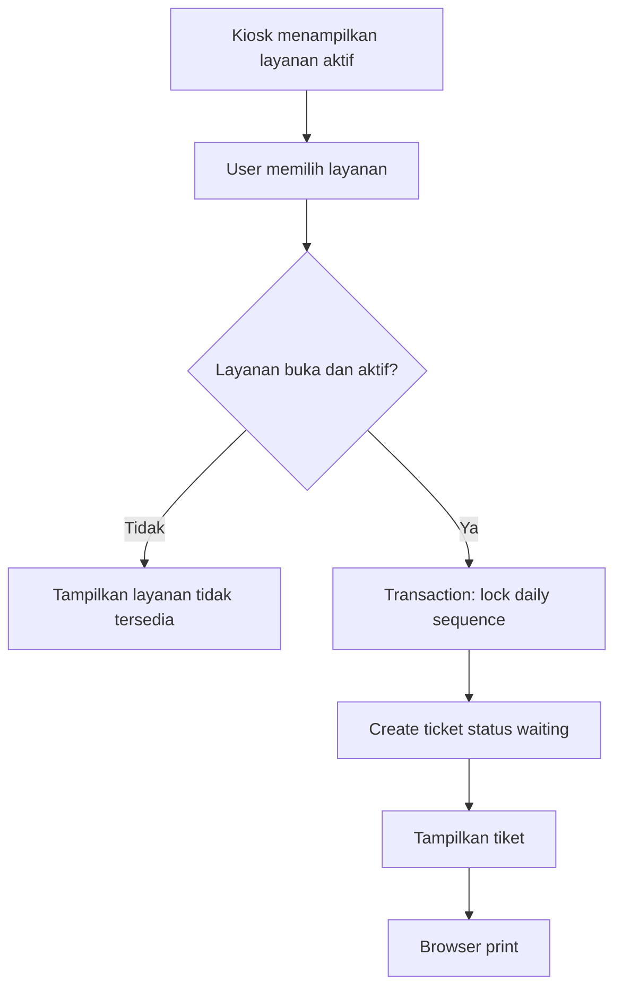
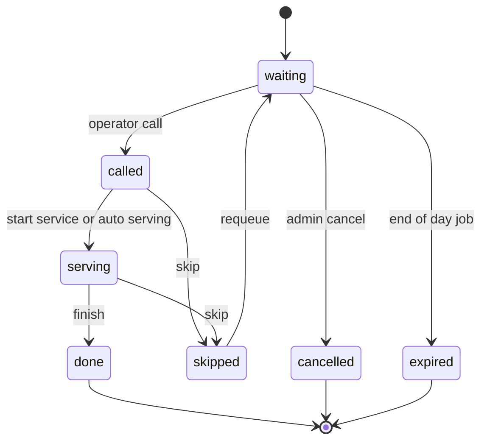
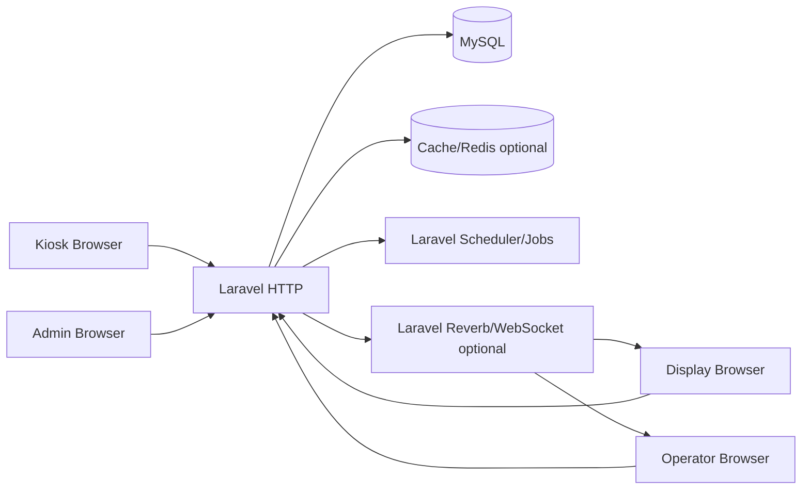

# Blueprint Aplikasi Sistem Antrian Berbasis Web

## 1. Document Control

| Item | Nilai |
|---|---|
| Judul | Blueprint Aplikasi Sistem Antrian Berbasis Web |
| Versi | 1.0 |
| Tanggal | 2026-05-06 |
| Prepared for | Tim implementasi full-stack / AI Agent coding |
| Prepared by | Codex - Analis Aplikasi |
| Status | Draft implementasi siap coding |
| Stack target | Laravel, MySQL, Tailwind CSS, Blade/Livewire atau Inertia sesuai keputusan teknis |

### Change History

| Versi | Tanggal | Perubahan | Penyusun |
|---|---|---|---|
| 1.0 | 2026-05-06 | Dokumen awal blueprint end-to-end | Codex |

## 2. Executive Summary

Aplikasi ini adalah sistem antrian berbasis web untuk mengelola layanan multi-loket secara real-time. Sistem menyediakan empat area utama:

1. Laman Admin untuk konfigurasi layanan, loket, operator, jam operasional, dan monitoring.
2. Laman Display untuk menampilkan informasi semua loket dan nomor yang sedang dipanggil.
3. Laman Operator Loket untuk memanggil, melewati, menyelesaikan, dan mengulang panggilan antrian.
4. Laman User/Kiosk untuk memilih jenis antrian dan mencetak tiket.

Masalah utama yang diselesaikan adalah antrean manual yang tidak transparan, sulit dimonitor, rawan duplikasi nomor, dan tidak menyediakan histori layanan. Solusi yang diusulkan menggunakan Laravel sebagai backend, MySQL sebagai database relasional, Tailwind CSS sebagai UI framework, serta opsi real-time melalui Laravel Reverb/WebSocket atau fallback polling.

### Expected Outcomes

| Outcome | Target |
|---|---|
| Pengambilan tiket mandiri | User dapat memilih layanan dan memperoleh tiket dalam kurang dari 10 detik |
| Pemanggilan loket terkontrol | Operator hanya dapat memanggil antrian sesuai layanan/loket yang ditugaskan |
| Display terpadu | Display memperbarui status panggilan maksimal 2 detik setelah aksi operator |
| Audit operasional | Semua aksi tiket, panggilan, skip, selesai, batal, dan login tercatat |
| Laporan dasar | Admin dapat melihat rekap antrian harian per layanan, loket, dan operator |

### Success Metrics

| ID | Metric | Target MVP |
|---|---|---|
| SM-001 | Waktu pembuatan tiket | P95 <= 2 detik setelah klik layanan |
| SM-002 | Latensi update display | P95 <= 2 detik dengan WebSocket, <= 5 detik dengan polling |
| SM-003 | Duplikasi nomor tiket harian | 0 kasus |
| SM-004 | Availability jam layanan | >= 99% pada jam operasional |
| SM-005 | Akurasi histori antrian | 100% event penting tercatat |

## 3. Goals, Scope, and Constraints

### Business Goals

| ID | Goal | Ukuran Keberhasilan |
|---|---|---|
| BG-001 | Menertibkan antrean layanan multi-loket | Tiket unik, panggilan berurutan, histori tersedia |
| BG-002 | Mengurangi beban petugas front desk | User dapat mengambil tiket mandiri |
| BG-003 | Meningkatkan transparansi layanan | Display publik menampilkan status semua loket |
| BG-004 | Menyediakan data operasional | Rekap jumlah antrean, waktu tunggu, dan penyelesaian tersedia |

### Product Goals

| ID | Goal | Ukuran Keberhasilan |
|---|---|---|
| PG-001 | Admin mudah mengatur layanan dan loket | CRUD tersedia dengan validasi |
| PG-002 | Operator fokus pada antrean loketnya | UI operator memuat tombol aksi utama tanpa navigasi kompleks |
| PG-003 | Display dapat berjalan di TV/browser | Tampilan responsive landscape dan auto-refresh |
| PG-004 | Kiosk user minim instruksi | Satu layar pilihan layanan dan hasil tiket siap print |

### In Scope

| ID | Scope |
|---|---|
| SC-001 | Login admin dan operator |
| SC-002 | Manajemen user, role, layanan, loket, penugasan operator |
| SC-003 | Pengambilan tiket antrian per layanan |
| SC-004 | Cetak tiket melalui browser print |
| SC-005 | Pemanggilan antrian oleh operator |
| SC-006 | Display semua loket secara real-time atau polling |
| SC-007 | Status tiket: waiting, called, serving, skipped, done, cancelled, expired |
| SC-008 | Dashboard ringkas dan laporan harian |
| SC-009 | Audit log dan backup database |

### Out of Scope MVP

| ID | Out of Scope | Catatan |
|---|---|---|
| OS-001 | Integrasi SMS/WhatsApp | Dapat menjadi fase 2 |
| OS-002 | Reservasi online dari luar lokasi | Dapat menjadi fase 2 |
| OS-003 | Mobile app native | Web responsive cukup untuk MVP |
| OS-004 | Pembayaran atau billing | Tidak relevan untuk sistem antrian dasar |
| OS-005 | Face recognition atau biometrik | Risiko privasi tinggi, tidak diperlukan |

### Assumptions

| ID | Asumsi |
|---|---|
| AS-001 | Sistem digunakan dalam satu instansi/lokasi pada MVP |
| AS-002 | Nomor antrian reset harian berdasarkan tanggal dan layanan |
| AS-003 | Tiket dicetak melalui printer thermal/browser print pada perangkat kiosk |
| AS-004 | Display dibuka pada browser TV/monitor dengan koneksi LAN/internet lokal |
| AS-005 | Operator login menggunakan akun masing-masing |
| AS-006 | Admin memiliki akses penuh ke konfigurasi dan laporan |

### Constraints

| ID | Constraint | Dampak |
|---|---|---|
| CN-001 | Stack wajib Laravel, MySQL, Tailwind | Arsitektur mengikuti Laravel monolith modular |
| CN-002 | Printer kiosk bergantung browser/OS | Perlu CSS print dan uji perangkat |
| CN-003 | Koneksi display bisa tidak stabil | Perlu fallback polling dan reconnect state |
| CN-004 | Real-time tidak boleh mengganggu transaksi inti | Nomor tiket tetap harus konsisten di database |

### Dependencies

| ID | Dependency | Keterangan |
|---|---|---|
| DP-001 | PHP 8.3+ | Runtime Laravel modern |
| DP-002 | Laravel 11/12 | Framework backend |
| DP-003 | MySQL 8+ | Transaction, index, JSON support |
| DP-004 | Node.js + Vite | Build Tailwind asset |
| DP-005 | Laravel Reverb/Pusher compatible | Opsional real-time |
| DP-006 | Printer thermal/kiosk | Verifikasi print tiket |

## 4. Stakeholders and Users

| Role | Goals | Responsibilities | Pain Points | Success Criteria |
|---|---|---|---|---|
| Pengunjung/User | Mengambil nomor antrian cepat | Memilih layanan, mengambil tiket | Bingung loket/layanan, menunggu tanpa kepastian | Tiket tercetak jelas dan nomor tampil di display |
| Operator Loket | Melayani antrean sesuai loket | Memanggil, ulang panggil, skip, selesai | Salah panggil, antrian tidak sinkron | Aksi loket cepat, nomor berikutnya tepat |
| Admin | Mengelola sistem | Konfigurasi layanan/loket/user, monitoring, laporan | Perubahan manual sulit dilacak | Konfigurasi mudah, data laporan akurat |
| Supervisor | Memantau performa layanan | Melihat antrean aktif dan rekap | Tidak tahu bottleneck | Dashboard menunjukkan antrean per layanan/loket |
| Technical Operator | Menjaga aplikasi berjalan | Deploy, backup, monitoring | Error tidak terlihat cepat | Log, alert, backup, runbook tersedia |
| Auditor Internal | Menelusuri histori aksi | Review audit dan laporan | Tidak ada jejak perubahan | Audit log lengkap dan dapat difilter |

## 5. Operating Context

| Area | Spesifikasi |
|---|---|
| Application type | Web application internal/public local kiosk |
| Platform | Browser desktop, tablet kiosk, TV display |
| Deployment | VPS, on-prem server, atau local server LAN |
| Coverage MVP | Satu organisasi/lokasi, multi-layanan, multi-loket |
| Data sensitivity | Rendah-sedang; tiket tidak wajib menyimpan identitas personal |
| Operational hours | Mengikuti jam layanan yang dikonfigurasi admin |
| Peak load | Awal jam layanan, setelah istirahat, hari pelayanan tinggi |
| Compliance | Praktik keamanan OWASP, privacy by design, auditability |
| Integration | Printer browser, opsional WebSocket, opsional text-to-speech browser |

## 6. Role and Permission Model

| Role | Permission |
|---|---|
| Super Admin | Semua akses termasuk konfigurasi sistem, user, role, laporan, audit |
| Admin | CRUD layanan, loket, operator assignment, dashboard, laporan |
| Supervisor | View dashboard, laporan, monitoring display, tanpa ubah konfigurasi inti |
| Operator | Akses laman operator untuk loket yang ditugaskan, panggil/skip/selesai |
| Display | Akses read-only display publik via signed token atau route publik terbatas |
| Kiosk/User | Akses pilih layanan dan cetak tiket tanpa login |

### Permission Matrix

| Capability | Super Admin | Admin | Supervisor | Operator | Display | Kiosk |
|---|---:|---:|---:|---:|---:|---:|
| Kelola user/role | Yes | Limited | No | No | No | No |
| Kelola layanan | Yes | Yes | No | No | No | No |
| Kelola loket | Yes | Yes | No | No | No | No |
| Assignment operator | Yes | Yes | No | No | No | No |
| Ambil tiket | Yes | Yes | Yes | Yes | No | Yes |
| Panggil antrian | No | No | No | Yes | No | No |
| Ulang panggil | No | No | No | Yes | No | No |
| Skip antrian | No | No | No | Yes | No | No |
| Selesaikan layanan | No | No | No | Yes | No | No |
| View display | Yes | Yes | Yes | Yes | Yes | Yes |
| View laporan | Yes | Yes | Yes | Limited own | No | No |
| View audit log | Yes | Yes | Limited | No | No | No |

## 7. Functional Requirements

| ID | Module | Requirement | Priority | Role | Acceptance Criteria |
|---|---|---|---|---|---|
| FR-001 | Auth | Sistem menyediakan login untuk admin, supervisor, dan operator | Must | Admin/Operator | User valid dapat login; user nonaktif ditolak; logout menghapus session |
| FR-002 | Role | Sistem membatasi akses berdasarkan role dan permission | Must | Semua role | Route dan tombol aksi hanya tersedia sesuai permission |
| FR-003 | Layanan | Admin dapat membuat, mengubah, menonaktifkan, dan mengurutkan layanan | Must | Admin | Layanan aktif tampil di kiosk; layanan nonaktif tidak tampil |
| FR-004 | Layanan | Setiap layanan memiliki kode prefix tiket | Must | Admin | Prefix unik, contoh A untuk Administrasi, B untuk Konsultasi |
| FR-005 | Loket | Admin dapat membuat, mengubah, menonaktifkan loket | Must | Admin | Loket aktif dapat dipakai operator dan tampil di display |
| FR-006 | Assignment | Admin dapat menugaskan operator ke loket dan layanan tertentu | Must | Admin | Operator hanya memanggil layanan yang ditugaskan |
| FR-007 | Jam Layanan | Admin dapat menentukan jam operasional per hari | Should | Admin | Kiosk menolak tiket di luar jam layanan dengan pesan jelas |
| FR-008 | Kiosk | User dapat melihat daftar layanan aktif | Must | Kiosk | Layanan tampil sebagai tombol besar, mudah disentuh |
| FR-009 | Kiosk | User dapat mengambil nomor antrian | Must | Kiosk | Sistem membuat nomor unik per layanan per tanggal |
| FR-010 | Kiosk | Sistem menampilkan halaman tiket dan memicu print browser | Must | Kiosk | Tiket memuat nomor, layanan, tanggal, waktu, estimasi antrian |
| FR-011 | Operator | Operator dapat melihat antrian menunggu sesuai assignment | Must | Operator | Daftar menampilkan nomor, waktu ambil, lama tunggu |
| FR-012 | Operator | Operator dapat memanggil nomor berikutnya | Must | Operator | Nomor waiting terlama berubah menjadi called/serving dan tampil di display |
| FR-013 | Operator | Operator dapat mengulang panggilan nomor aktif | Must | Operator | Event ulang panggil terkirim ke display tanpa mengubah nomor |
| FR-014 | Operator | Operator dapat melewati antrian | Must | Operator | Status berubah skipped, alasan opsional tercatat |
| FR-015 | Operator | Operator dapat menyelesaikan layanan | Must | Operator | Status berubah done dan waktu selesai tercatat |
| FR-016 | Operator | Operator dapat memanggil ulang antrian skipped | Should | Operator | Skipped dapat dikembalikan ke waiting/called sesuai aturan |
| FR-017 | Display | Display menampilkan semua loket aktif dan nomor saat ini | Must | Display | Setiap loket menampilkan nomor, layanan, dan status |
| FR-018 | Display | Display menonjolkan panggilan terbaru | Must | Display | Panggilan terbaru tampil lebih besar dan/atau ada suara |
| FR-019 | Display | Display auto-refresh secara real-time/polling | Must | Display | Perubahan operator terlihat tanpa reload manual |
| FR-020 | Dashboard | Admin melihat ringkasan antrean hari ini | Must | Admin/Supervisor | Total waiting, serving, done, skipped per layanan/loket tampil |
| FR-021 | Laporan | Admin dapat memfilter laporan berdasarkan tanggal, layanan, loket, operator | Should | Admin/Supervisor | Filter menghasilkan tabel rekap dan detail |
| FR-022 | Audit | Sistem mencatat aksi penting | Must | Sistem | Login, CRUD konfigurasi, create ticket, call, skip, done tercatat |
| FR-023 | Setting | Admin dapat mengubah nama instansi, teks tiket, dan opsi print | Should | Admin | Perubahan terlihat pada display/tiket |
| FR-024 | Reset Harian | Nomor antrian reset otomatis per tanggal layanan | Must | Sistem | Nomor A001 hari ini tidak bertabrakan dengan hari lain |
| FR-025 | Manual Cancel | Admin dapat membatalkan tiket yang salah/invalid | Should | Admin | Status cancelled, alasan wajib, audit tercatat |
| FR-026 | Public Safety | Route kiosk dan display tidak dapat mengubah konfigurasi | Must | Sistem | Hanya endpoint whitelisted tersedia tanpa login |

## 8. Business Rules

| ID | Rule | Applies To | Source | Exception Handling |
|---|---|---|---|---|
| BR-001 | Nomor tiket dibentuk dari prefix layanan + sequence 3 digit minimum, contoh A001 | Ticket | Operasional | Jika >999, lanjut A1000 |
| BR-002 | Sequence reset per tanggal dan layanan | Ticket | Operasional | Tanggal memakai timezone aplikasi |
| BR-003 | Tiket hanya dapat dibuat untuk layanan aktif | Kiosk | Konfigurasi | Tampilkan layanan tidak tersedia |
| BR-004 | Operator hanya dapat memanggil layanan yang ditugaskan ke loketnya | Operator | Keamanan | Tampilkan error 403 dan audit warning |
| BR-005 | Satu loket hanya boleh memiliki satu tiket aktif called/serving pada satu waktu | Operator | Integritas layanan | Operator harus done/skip sebelum panggil berikutnya |
| BR-006 | Pemanggilan berikutnya mengambil tiket waiting paling lama berdasarkan created_at/id | Queue | FIFO | Priority service dapat ditambahkan fase 2 |
| BR-007 | Tiket skipped tidak otomatis dipanggil lagi kecuali operator/admin mengembalikan status | Queue | Operasional | Requeue dengan audit alasan |
| BR-008 | Tiket expired jika melewati akhir hari layanan dan belum selesai | Queue | Operasional | Job harian menandai expired |
| BR-009 | Nomor tiket tidak boleh dihapus fisik setelah dibuat | Audit | Auditability | Gunakan status cancelled |
| BR-010 | Perubahan konfigurasi layanan/loket tidak mengubah histori tiket lama | Reporting | Integritas laporan | Simpan snapshot nama layanan/loket pada ticket/call |
| BR-011 | Display hanya menampilkan antrian tanggal berjalan | Display | Operasional | Admin dapat override tanggal untuk debug |
| BR-012 | Print tiket harus tetap dapat dilakukan walau real-time server mati | Kiosk | Resilience | Tiket dibuat via HTTP transaction |

## 9. Non-Functional Requirements

| ID | Quality Attribute | Requirement | Target/Metric | Verification |
|---|---|---|---|---|
| NFR-001 | Performance | Pembuatan tiket cepat | P95 <= 2 detik pada 50 concurrent users | Load test |
| NFR-002 | Performance | Aksi panggil cepat | P95 <= 1 detik backend response | Integration/performance test |
| NFR-003 | Real-time | Update display cepat | P95 <= 2 detik WebSocket atau <= 5 detik polling | E2E test |
| NFR-004 | Availability | Sistem tersedia selama jam layanan | >= 99% monthly saat jam operasional | Monitoring uptime |
| NFR-005 | Integrity | Tidak ada nomor ganda | 0 duplicate berdasarkan unique index | DB constraint test |
| NFR-006 | Security | Proteksi akses berbasis role | 100% protected route memakai middleware | Security test |
| NFR-007 | Privacy | Tidak wajib menyimpan data personal pengunjung | Default ticket anonymous | Data review |
| NFR-008 | Accessibility | UI admin/operator memenuhi aksesibilitas dasar | WCAG 2.1 AA untuk kontras/fokus | Accessibility audit |
| NFR-009 | Usability | Kiosk touch-friendly | Target tombol minimum 44x44px | Visual QA |
| NFR-010 | Maintainability | Kode modular | Controller/service/action terpisah per domain | Code review |
| NFR-011 | Observability | Error dan event penting tercatat | Log structured untuk action utama | Log review |
| NFR-012 | Backup | Database dapat dipulihkan | Backup harian, restore drill bulanan | Restore test |
| NFR-013 | Browser Support | Mendukung Chrome/Edge modern | 2 versi mayor terbaru | Cross-browser test |
| NFR-014 | Localization | Format tanggal/waktu lokal | Timezone Asia/Makassar default configurable | Unit test |
| NFR-015 | Recovery | Kegagalan WebSocket tidak menghentikan operasi | Fallback polling aktif | Failure test |

## 10. Domain Model and Data Design

### Core Entity Overview

| Entity | Purpose | Key Fields | Relationships | Lifecycle States |
|---|---|---|---|---|
| users | Akun admin/operator/supervisor | id, name, email, password, role, is_active | hasMany counter_assignments, queue_calls | active, inactive |
| services | Master jenis layanan | id, code, name, description, prefix, is_active, sort_order | hasMany tickets, counter_services | active, inactive |
| counters | Master loket | id, code, name, location, is_active, sort_order | hasMany assignments, calls | active, inactive |
| counter_services | Layanan yang dapat dilayani loket | id, counter_id, service_id | belongsTo counter/service | active by relation |
| counter_assignments | Penugasan operator | id, user_id, counter_id, start_at, end_at, is_active | belongsTo user/counter | active, ended |
| tickets | Tiket antrian | id, service_id, ticket_date, sequence_no, ticket_no, status | hasMany queue_calls | waiting, called, serving, skipped, done, cancelled, expired |
| queue_calls | Histori panggilan | id, ticket_id, counter_id, operator_id, call_no, status, called_at | belongsTo ticket/counter/user | called, recalled, serving, skipped, done |
| daily_sequences | Kontrol sequence harian | id, service_id, sequence_date, last_number | belongsTo service | active |
| settings | Konfigurasi aplikasi | key, value, group | none | active |
| audit_logs | Audit aksi | actor_id, action, entity_type, entity_id, metadata, ip | belongsTo user optional | immutable |
| operating_hours | Jam layanan | day_of_week, open_time, close_time, is_closed | none | active/inactive |

### Recommended MySQL Tables

#### users

| Field | Type | Constraint/Index | Notes |
|---|---|---|---|
| id | BIGINT UNSIGNED | PK | Laravel default |
| name | VARCHAR(150) | NOT NULL | Nama user |
| email | VARCHAR(150) | UNIQUE, NOT NULL | Login |
| password | VARCHAR(255) | NOT NULL | Hash bcrypt/argon |
| role | ENUM | INDEX | super_admin, admin, supervisor, operator |
| is_active | BOOLEAN | INDEX default true | Blokir login jika false |
| last_login_at | TIMESTAMP NULL |  | Audit ringkas |
| created_at/updated_at | TIMESTAMP |  | Laravel default |

#### services

| Field | Type | Constraint/Index | Notes |
|---|---|---|---|
| id | BIGINT UNSIGNED | PK |  |
| code | VARCHAR(30) | UNIQUE | Kode internal |
| name | VARCHAR(120) | NOT NULL | Nama tampil |
| description | TEXT NULL |  | Deskripsi opsional |
| prefix | VARCHAR(5) | UNIQUE, NOT NULL | Prefix tiket |
| color | VARCHAR(20) NULL |  | Tailwind-safe token atau hex |
| is_active | BOOLEAN | INDEX |  |
| sort_order | INT | INDEX | Urutan kiosk |
| created_at/updated_at | TIMESTAMP |  |  |

#### counters

| Field | Type | Constraint/Index | Notes |
|---|---|---|---|
| id | BIGINT UNSIGNED | PK |  |
| code | VARCHAR(30) | UNIQUE | LK-01 |
| name | VARCHAR(120) | NOT NULL | Loket 1 |
| location | VARCHAR(120) NULL |  | Area layanan |
| is_active | BOOLEAN | INDEX |  |
| sort_order | INT | INDEX | Urutan display |
| created_at/updated_at | TIMESTAMP |  |  |

#### tickets

| Field | Type | Constraint/Index | Notes |
|---|---|---|---|
| id | BIGINT UNSIGNED | PK |  |
| service_id | BIGINT UNSIGNED | FK, INDEX | services.id |
| ticket_date | DATE | UNIQUE composite | Tanggal sequence |
| sequence_no | INT UNSIGNED | UNIQUE composite | Nomor urut harian per layanan |
| ticket_no | VARCHAR(20) | INDEX | Contoh A001 |
| service_name_snapshot | VARCHAR(120) | NOT NULL | Stabil untuk laporan |
| status | ENUM | INDEX | waiting, called, serving, skipped, done, cancelled, expired |
| printed_at | TIMESTAMP NULL |  | Saat halaman print dibuat |
| called_at | TIMESTAMP NULL | INDEX | Panggilan pertama |
| started_at | TIMESTAMP NULL |  | Mulai dilayani |
| completed_at | TIMESTAMP NULL | INDEX | Selesai |
| skipped_at | TIMESTAMP NULL |  | Skip |
| cancelled_at | TIMESTAMP NULL |  | Batal |
| cancel_reason | VARCHAR(255) NULL |  | Wajib jika cancelled |
| meta | JSON NULL |  | Device/kiosk info |
| created_at/updated_at | TIMESTAMP |  |  |

Unique index: `(service_id, ticket_date, sequence_no)`.

#### queue_calls

| Field | Type | Constraint/Index | Notes |
|---|---|---|---|
| id | BIGINT UNSIGNED | PK |  |
| ticket_id | BIGINT UNSIGNED | FK, INDEX | tickets.id |
| counter_id | BIGINT UNSIGNED | FK, INDEX | counters.id |
| operator_id | BIGINT UNSIGNED | FK, INDEX | users.id |
| call_no | INT UNSIGNED | NOT NULL | Panggilan ke-n |
| event_type | ENUM | INDEX | call, recall, start, skip, done |
| counter_name_snapshot | VARCHAR(120) | NOT NULL | Stabil untuk display/history |
| operator_name_snapshot | VARCHAR(150) | NOT NULL | Stabil untuk audit |
| called_at | TIMESTAMP | INDEX | Waktu event |
| notes | VARCHAR(255) NULL |  | Alasan skip/catatan |
| created_at/updated_at | TIMESTAMP |  |  |

#### daily_sequences

| Field | Type | Constraint/Index | Notes |
|---|---|---|---|
| id | BIGINT UNSIGNED | PK |  |
| service_id | BIGINT UNSIGNED | UNIQUE composite | services.id |
| sequence_date | DATE | UNIQUE composite | Tanggal |
| last_number | INT UNSIGNED | NOT NULL default 0 | Increment dalam transaction |
| created_at/updated_at | TIMESTAMP |  |  |

#### audit_logs

| Field | Type | Constraint/Index | Notes |
|---|---|---|---|
| id | BIGINT UNSIGNED | PK |  |
| actor_id | BIGINT UNSIGNED NULL | FK, INDEX | Null untuk kiosk/system |
| action | VARCHAR(100) | INDEX | ticket.created, queue.called |
| entity_type | VARCHAR(100) | INDEX | Ticket, Service |
| entity_id | BIGINT UNSIGNED NULL | INDEX |  |
| ip_address | VARCHAR(45) NULL |  | IPv4/IPv6 |
| user_agent | VARCHAR(255) NULL |  |  |
| metadata | JSON NULL |  | Before/after/context |
| created_at | TIMESTAMP | INDEX | Immutable |

### Data Retention

| Data | Retention | Rule |
|---|---|---|
| Tickets dan queue_calls | Minimal 2 tahun atau sesuai kebijakan instansi | Archive bulanan jika data besar |
| Audit logs | Minimal 1 tahun | Immutable, tidak diedit manual |
| User inactive | Dipertahankan untuk histori | Tidak hard delete jika punya audit |
| Anonymous kiosk metadata | Maksimal 90 hari jika menyimpan device/ip | Masking/anonymization bila diperlukan |

## 11. Workflow and Process Design

### WF-001 User Mengambil Tiket

| Area | Detail |
|---|---|
| Trigger | User membuka laman kiosk dan memilih layanan |
| Actors | User/Kiosk, sistem |
| Preconditions | Layanan aktif, jam layanan buka |
| Main Path | User pilih layanan; sistem validasi; sistem lock/increment sequence; sistem membuat tiket waiting; sistem tampilkan tiket; browser print |
| Alternate Path | Jika print gagal, user dapat klik print ulang tanpa membuat tiket baru |
| Failure Path | Jika layanan tutup/nonaktif, tampilkan error dan jangan buat tiket |
| Audit Events | ticket.created, ticket.printed |



### WF-002 Operator Memanggil Antrian Berikutnya

| Area | Detail |
|---|---|
| Trigger | Operator klik tombol Panggil Berikutnya |
| Actors | Operator, sistem, display |
| Preconditions | Operator login, assignment aktif, loket tidak punya tiket aktif |
| Main Path | Sistem ambil waiting terlama sesuai layanan loket; update ticket called/serving; create queue_call; broadcast QueueCalled; display update |
| Alternate Path | Jika tidak ada waiting, UI menampilkan kosong |
| Failure Path | Jika loket masih punya tiket aktif, sistem menolak panggil berikutnya |
| Audit Events | queue.called |



### WF-003 Display Update

| Area | Detail |
|---|---|
| Trigger | queue.called atau queue.recalled event |
| Actors | Display browser, backend real-time |
| Preconditions | Display route terbuka dengan token/publik terbatas |
| Main Path | Browser subscribe channel display; menerima event; update kartu loket; mainkan suara opsional |
| Fallback | Polling endpoint `/api/display/state` setiap 3-5 detik |
| Failure Path | Jika koneksi putus, tampilkan indikator reconnect dan pakai polling |

### WF-004 End of Day

| Area | Detail |
|---|---|
| Trigger | Scheduler Laravel setelah jam layanan selesai |
| Actors | Sistem |
| Preconditions | Konfigurasi operating hours tersedia |
| Main Path | Ticket waiting/called yang belum selesai ditandai expired; summary harian tersedia |
| Audit Events | ticket.expired.batch |

## 12. Modules and Feature Breakdown

### MOD-001 Authentication and Authorization

| Area | Detail |
|---|---|
| Purpose | Mengamankan akses admin, supervisor, dan operator |
| Users | Super Admin, Admin, Supervisor, Operator |
| Features | Login, logout, session timeout, middleware role |
| Data | users, audit_logs |
| Screens | Login, profile/password |
| APIs | POST `/login`, POST `/logout` jika memakai Blade auth |
| Edge Cases | User inactive, password salah, session expired |
| Acceptance | User hanya dapat masuk ke halaman sesuai role |

### MOD-002 Admin Master Data

| Area | Detail |
|---|---|
| Purpose | Mengatur layanan, loket, assignment, jam layanan |
| Users | Super Admin, Admin |
| Features | CRUD services, counters, counter_services, assignments, operating_hours, settings |
| Data | services, counters, counter_services, counter_assignments, settings |
| Screens | Dashboard, layanan, loket, assignment, setting |
| APIs | Resource controllers admin |
| Edge Cases | Prefix duplikat, loket nonaktif dengan assignment aktif |
| Acceptance | Konfigurasi aktif langsung memengaruhi kiosk/operator/display |

### MOD-003 Kiosk Ticketing

| Area | Detail |
|---|---|
| Purpose | Memungkinkan user mengambil tiket mandiri |
| Users | Kiosk/User |
| Features | Daftar layanan, create ticket, print ticket, reprint last ticket session |
| Data | services, tickets, daily_sequences, audit_logs |
| Screens | Pilih layanan, tiket print |
| APIs | POST `/kiosk/tickets` |
| Edge Cases | Double click, reload setelah create, printer tidak tersedia |
| Acceptance | Double click tidak membuat tiket ganda bila request idempotency aktif |

### MOD-004 Operator Queue Console

| Area | Detail |
|---|---|
| Purpose | Mengelola proses panggilan dan layanan loket |
| Users | Operator |
| Features | Panggil berikutnya, ulang panggil, skip, selesai, lihat waiting list |
| Data | tickets, queue_calls, counter_assignments |
| Screens | Console operator |
| APIs | POST `/operator/queue/call-next`, `/recall`, `/skip`, `/done` |
| Edge Cases | Dua operator memanggil bersamaan, assignment berakhir |
| Acceptance | Transaction lock mencegah satu tiket dipanggil dua loket |

### MOD-005 Display Queue Board

| Area | Detail |
|---|---|
| Purpose | Menampilkan status semua loket kepada publik |
| Users | Display/Public |
| Features | Current call, daftar semua loket, panggilan terbaru, audio/browser speech |
| Data | counters, tickets, queue_calls |
| Screens | Display board |
| APIs | GET `/api/display/state`, WebSocket `QueueCalled` |
| Edge Cases | TV refresh, koneksi putus, tidak ada antrian |
| Acceptance | Display tetap informatif saat kosong atau offline sementara |

### MOD-006 Reporting and Audit

| Area | Detail |
|---|---|
| Purpose | Monitoring operasional dan traceability |
| Users | Admin, Supervisor |
| Features | Rekap harian, filter detail, export CSV, audit log |
| Data | tickets, queue_calls, audit_logs |
| Screens | Laporan, audit log |
| APIs | GET `/admin/reports/queues`, export endpoint |
| Edge Cases | Data besar, filter kosong |
| Acceptance | Rekap sesuai agregasi database dan dapat diverifikasi dari detail |

## 13. UI and Experience Blueprint

### Navigation Model

| Area | Navigation |
|---|---|
| Admin | Sidebar: Dashboard, Layanan, Loket, Operator Assignment, Laporan, Audit, Setting |
| Supervisor | Sidebar terbatas: Dashboard, Laporan |
| Operator | Single console page; optional dropdown pilih loket jika punya beberapa assignment |
| Display | Fullscreen route tanpa sidebar |
| Kiosk | Fullscreen touch UI tanpa sidebar |

### Screen Inventory

| UI ID | Screen | Role | Purpose | Key Actions | Data Shown | Validation/Error States |
|---|---|---|---|---|---|---|
| UI-001 | Login | Admin/Operator | Masuk sistem | Login | Email, password | Kredensial salah, user inactive |
| UI-002 | Admin Dashboard | Admin/Supervisor | Monitoring hari ini | Filter tanggal, refresh | Total waiting/called/done/skipped | Data kosong |
| UI-003 | Services Index | Admin | Kelola layanan | Create, edit, deactivate, reorder | Kode, nama, prefix, status | Prefix duplikat |
| UI-004 | Service Form | Admin | Input layanan | Save, cancel | Field layanan | Required, unique, format prefix |
| UI-005 | Counters Index | Admin | Kelola loket | Create, edit, deactivate | Kode, nama, status | Loket sedang dipakai |
| UI-006 | Counter Form | Admin | Input loket | Save, cancel | Field loket | Kode duplikat |
| UI-007 | Assignment | Admin | Tugas operator | Assign, end assignment | Operator, loket, layanan | Assignment overlap |
| UI-008 | Operating Hours | Admin | Jam layanan | Save schedule | Hari, buka, tutup | Jam tutup <= buka |
| UI-009 | Operator Console | Operator | Panggil antrian | Call next, recall, skip, done | Nomor aktif, waiting list, stats | Tidak ada antrian, loket sibuk |
| UI-010 | Display Board | Display | Info publik | Fullscreen, auto update | Panggilan terbaru, semua loket | Offline/reconnecting |
| UI-011 | Kiosk Services | Kiosk | Pilih layanan | Tap layanan | Layanan aktif | Layanan tutup |
| UI-012 | Ticket Print | Kiosk | Cetak tiket | Print, kembali | Nomor tiket, layanan, waktu | Print blocked |
| UI-013 | Reports | Admin/Supervisor | Rekap antrian | Filter, export | Tabel dan ringkasan | Filter invalid |
| UI-014 | Audit Logs | Admin | Trace event | Search/filter | Actor, action, entity, waktu | Data kosong |
| UI-015 | Settings | Admin | Branding/opsi | Save | Nama instansi, teks tiket, mode audio | Invalid setting |

### UI Detail Requirements

| Area | Requirement |
|---|---|
| Kiosk | Tombol layanan besar, minimum 2 kolom desktop/tablet, 1 kolom mobile, target touch >= 44px |
| Ticket Print | CSS `@media print`, ukuran thermal 58mm/80mm configurable, hide tombol saat print |
| Operator | Tombol utama memakai warna berbeda: call primary, recall neutral, skip warning, done success |
| Display | Layout landscape TV: panggilan terbaru dominan, grid loket stabil, font besar, kontras tinggi |
| Admin | Tailwind layout utilitarian, tabel dense, filter jelas, pagination |
| Empty State | Gunakan pesan operasional singkat, contoh "Belum ada antrian menunggu" |
| Loading State | Skeleton/spinner ringan; aksi tombol disabled saat submit |
| Error State | Pesan spesifik, tidak mengekspos stack trace |
| Accessibility | Focus ring terlihat, label form eksplisit, kontras minimal 4.5:1 untuk teks normal |

## 14. API and Integration Blueprint

### Service Boundary

Aplikasi direkomendasikan sebagai Laravel monolith modular:

| Boundary | Responsibility |
|---|---|
| HTTP Controllers | Request validation, auth middleware, response |
| Actions/Services | Business transaction: create ticket, call next, skip, done |
| Models | Eloquent relations, scopes, casts |
| Events | Broadcast queue state changes |
| Jobs/Scheduler | Expire tickets, backup trigger, summary cache |
| Policies | Authorization by role/assignment |

### Endpoint Inventory

| API ID | Method/Event | Path/Topic | Purpose | Caller | Auth | Request | Response | Errors |
|---|---|---|---|---|---|---|---|---|
| API-001 | GET | `/login` | Form login | Browser | Guest | - | HTML | - |
| API-002 | POST | `/login` | Authenticate | Browser | Guest | email, password | Redirect | 422, 403 |
| API-003 | POST | `/logout` | Logout | Browser | Auth | CSRF | Redirect | 419 |
| API-004 | GET | `/admin/dashboard` | Dashboard | Admin | Auth role | filters | HTML/JSON data | 403 |
| API-005 | CRUD | `/admin/services` | Manage services | Admin | Auth role | service payload | HTML/redirect | 422, 403 |
| API-006 | CRUD | `/admin/counters` | Manage counters | Admin | Auth role | counter payload | HTML/redirect | 422, 403 |
| API-007 | CRUD | `/admin/assignments` | Manage assignments | Admin | Auth role | user_id, counter_id, service_ids | HTML/redirect | 422 |
| API-008 | GET | `/kiosk` | Kiosk service list | Kiosk | Public | - | HTML | 503 if closed |
| API-009 | POST | `/kiosk/tickets` | Create ticket | Kiosk | Public + CSRF/rate limit | service_id, idempotency_key | ticket payload/redirect | 422, 409, 503 |
| API-010 | GET | `/kiosk/tickets/{ticket}` | Ticket print view | Kiosk | Signed/session | ticket id | HTML print | 404 |
| API-011 | GET | `/operator` | Operator console | Operator | Auth operator | - | HTML | 403 |
| API-012 | POST | `/operator/queue/call-next` | Call next ticket | Operator | Auth operator | counter_id | active ticket | 404, 409, 403 |
| API-013 | POST | `/operator/queue/{ticket}/recall` | Recall active ticket | Operator | Auth operator | counter_id | event payload | 409, 403 |
| API-014 | POST | `/operator/queue/{ticket}/skip` | Skip ticket | Operator | Auth operator | reason | ticket payload | 409, 403 |
| API-015 | POST | `/operator/queue/{ticket}/done` | Finish ticket | Operator | Auth operator | notes optional | ticket payload | 409, 403 |
| API-016 | GET | `/display` | Display board | Display | Public/signed | - | HTML | 403 if token invalid |
| API-017 | GET | `/api/display/state` | Current display state | Display | Public/signed | date optional | JSON state | 429 |
| API-018 | Event | `display.queue-called` | Broadcast call event | Backend | Channel auth optional | ticket/counter payload | Browser event | reconnect |
| API-019 | GET | `/admin/reports/queues` | Queue report | Admin/Supervisor | Auth role | date range, service, counter | HTML/JSON | 422 |
| API-020 | GET | `/admin/reports/queues/export` | Export CSV | Admin/Supervisor | Auth role | filters | CSV | 422 |
| API-021 | GET | `/admin/audit-logs` | Audit log | Admin | Auth role | filters | HTML | 403 |

### Request/Response Examples

#### Create Ticket Request

```json
{
  "service_id": 1,
  "idempotency_key": "kiosk-01-20260506-uuid"
}
```

#### Create Ticket Response

```json
{
  "id": 125,
  "ticket_no": "A025",
  "service_name": "Administrasi",
  "status": "waiting",
  "created_at": "2026-05-06T09:15:20+08:00",
  "waiting_count_before": 7,
  "print_url": "/kiosk/tickets/125?signature=..."
}
```

#### Display State Response

```json
{
  "generated_at": "2026-05-06T09:20:00+08:00",
  "latest_call": {
    "ticket_no": "A025",
    "service_name": "Administrasi",
    "counter_name": "Loket 1",
    "called_at": "2026-05-06T09:19:58+08:00"
  },
  "counters": [
    {
      "id": 1,
      "name": "Loket 1",
      "current_ticket_no": "A025",
      "service_name": "Administrasi",
      "status": "serving"
    }
  ]
}
```

### Error Code Convention

| Code | Meaning |
|---|---|
| 400 | Bad request format |
| 401 | Not authenticated |
| 403 | Not authorized / role mismatch |
| 404 | Resource not found |
| 409 | State conflict, example loket masih melayani tiket |
| 419 | CSRF/session expired |
| 422 | Validation error |
| 429 | Rate limited |
| 503 | Service closed/unavailable |

## 15. Architecture Blueprint

### Recommended Architecture

Laravel monolith modular dengan server-rendered UI untuk kecepatan implementasi. Gunakan Blade + Alpine.js untuk MVP. Livewire dapat dipakai untuk operator/admin interaktif. Inertia/Vue/React hanya direkomendasikan jika tim sudah memiliki standard SPA.



### Backend Components

| Component | Responsibility |
|---|---|
| `CreateTicketAction` | Transactional ticket creation and sequence increment |
| `CallNextTicketAction` | Lock waiting ticket, assign loket, create call event |
| `RecallTicketAction` | Create recall event for active ticket |
| `SkipTicketAction` | Change status skipped, record reason |
| `CompleteTicketAction` | Change status done, record completed_at |
| `DisplayStateService` | Build read model for display |
| `QueueReportService` | Aggregate report metrics |
| `AuditLogger` | Centralized audit log writer |
| `OperatingHoursService` | Determine open/closed state |

### Suggested Laravel Structure

```text
app/
  Actions/
    Queue/CreateTicketAction.php
    Queue/CallNextTicketAction.php
    Queue/RecallTicketAction.php
    Queue/SkipTicketAction.php
    Queue/CompleteTicketAction.php
  Events/
    QueueCalled.php
    QueueRecalled.php
  Http/
    Controllers/
      Admin/
      Operator/
      KioskController.php
      DisplayController.php
    Requests/
  Models/
    Service.php
    Counter.php
    Ticket.php
    QueueCall.php
  Policies/
  Services/
    DisplayStateService.php
    QueueReportService.php
    OperatingHoursService.php
routes/
  web.php
  api.php
resources/views/
  admin/
  operator/
  kiosk/
  display/
database/migrations/
database/seeders/
```

### Transaction and Locking Requirements

| Operation | Requirement |
|---|---|
| Create ticket | Use DB transaction; lock `daily_sequences` row with `lockForUpdate`; create sequence row if absent safely |
| Call next | Use DB transaction; query waiting tickets with `lockForUpdate`; ensure no active ticket for counter |
| Complete/skip | Verify ticket is current for operator counter before update |
| Reprint | Must not create new ticket |
| Duplicate request | Use idempotency key if kiosk can double submit |

### Caching and Real-Time

| Area | Recommendation |
|---|---|
| Display state | Cache short TTL 1-3 seconds if traffic high |
| Real-time | Laravel Reverb for self-hosted WebSocket |
| Fallback | Poll `/api/display/state` every 3-5 seconds |
| Queue jobs | Not required for core transaction; use scheduler for expiry/report cache |

## 16. Security, Privacy, and Compliance

### Identity and Access

| ID | Requirement |
|---|---|
| SEC-001 | Semua route admin/operator wajib middleware `auth` dan role/policy |
| SEC-002 | Password di-hash menggunakan Laravel default hasher |
| SEC-003 | User inactive tidak dapat login atau menggunakan session lama |
| SEC-004 | Session timeout configurable, default 8 jam atau sesuai jam kerja |
| SEC-005 | Public display route memakai signed token bila display tidak boleh terbuka umum |

### OWASP-Aware Controls

| Risk | Control |
|---|---|
| Broken Access Control | Policy per module, assignment check untuk operator |
| Injection | Eloquent query binding, validasi request, tidak raw SQL tanpa binding |
| XSS | Blade escaping default, sanitasi setting teks yang tampil publik |
| CSRF | CSRF untuk semua POST web, termasuk kiosk |
| Authentication Failures | Rate limit login, inactive user check |
| Security Misconfiguration | `.env` aman, debug off production, secure headers |
| Vulnerable Components | Composer/npm audit di CI |
| Logging Gaps | Audit log untuk aksi kritis |

### Audit Events

| Event | Actor | Metadata Minimum |
|---|---|---|
| auth.login | user | ip, user_agent |
| auth.failed | system | email, ip |
| service.created/updated/deactivated | admin | before/after |
| counter.created/updated/deactivated | admin | before/after |
| assignment.created/ended | admin | user_id, counter_id, service_ids |
| ticket.created | kiosk/system | ticket_no, service_id, kiosk id/ip |
| ticket.printed | kiosk/system | ticket_id |
| queue.called | operator | ticket_id, counter_id |
| queue.recalled | operator | ticket_id, counter_id, call_no |
| queue.skipped | operator | ticket_id, reason |
| queue.done | operator | ticket_id, duration |
| ticket.cancelled | admin | ticket_id, reason |
| ticket.expired.batch | system | date, count |

### Privacy

| Area | Rule |
|---|---|
| Personal data | Tidak menyimpan nama/NIK pengunjung pada MVP |
| IP/User agent | Hanya untuk audit teknis, retention terbatas |
| Public display | Tidak menampilkan data personal |
| Export | Hanya admin/supervisor; catat audit saat export |

## 17. Testing and Quality Strategy

### Test Coverage

| Test Type | Scope |
|---|---|
| Unit | Sequence generator, operating hours, status transition validation |
| Feature | Auth, role access, CRUD layanan/loket, ticket creation, operator actions |
| Integration | Transaction locking create ticket/call next, display state API |
| Browser/E2E | Kiosk create print flow, operator call, display update |
| Security | Route authorization, CSRF, rate limit, inactive user |
| Performance | Concurrent ticket creation, call next latency, display polling load |
| Accessibility | Kiosk touch target, display contrast, admin form labels |
| Migration | Fresh migrate, seed demo, rollback where safe |
| UAT | Simulasi hari layanan dengan admin/operator/display/kiosk |

### Requirement-to-Test Traceability

| Requirement ID | Test ID | Test Type | Scenario | Expected Result |
|---|---|---|---|---|
| FR-001 | TC-001 | Feature | Login user aktif dan inactive | Aktif berhasil, inactive ditolak |
| FR-003 | TC-002 | Feature | Admin CRUD layanan | Layanan tersimpan dan tampil sesuai status |
| FR-009 | TC-003 | Integration | Create ticket concurrent 50 request | Tidak ada duplicate sequence |
| FR-010 | TC-004 | Browser | Cetak tiket | Print view memuat nomor dan CSS print |
| FR-012 | TC-005 | Integration | Operator call next | Ticket waiting berubah called/serving |
| FR-014 | TC-006 | Feature | Skip ticket | Status skipped dan reason tersimpan |
| FR-017 | TC-007 | Feature/API | Fetch display state | Semua loket aktif tampil |
| FR-019 | TC-008 | E2E | Operator call lalu display update | Display menampilkan nomor terbaru |
| FR-020 | TC-009 | Feature | Dashboard harian | Agregasi sesuai ticket fixtures |
| FR-022 | TC-010 | Feature | Aksi kritis | Audit log tercatat |
| BR-005 | TC-011 | Integration | Loket punya ticket aktif lalu call next | Sistem menolak 409 |
| NFR-006 | TC-012 | Security | Operator akses admin route | Ditolak 403 |
| NFR-015 | TC-013 | E2E | WebSocket disconnect | Polling tetap update state |

### Acceptance Criteria Critical Journeys

| Journey | Acceptance Criteria |
|---|---|
| Ambil tiket | User pilih layanan aktif, tiket unik dibuat, halaman print muncul, nomor tersimpan waiting |
| Panggil antrian | Operator valid menekan call next, sistem memilih waiting terlama, display update |
| Selesaikan layanan | Ticket aktif berubah done, loket dapat memanggil nomor berikutnya |
| Skip | Ticket aktif berubah skipped, tidak tampil sebagai current, audit menyimpan alasan |
| Display | Semua loket aktif tampil, panggilan terbaru dominan, reconnect/fallback bekerja |
| Laporan | Rekap total cocok dengan detail ticket dan queue_calls |

## 18. DevOps and Operations

### Environments

| Environment | Purpose | Data |
|---|---|---|
| Local | Development | Seeder dummy |
| Staging | UAT dan training | Data dummy mendekati real |
| Production | Operasional | Data real |

### Configuration

| Env Key | Purpose |
|---|---|
| `APP_TIMEZONE` | Default `Asia/Makassar` atau sesuai lokasi |
| `QUEUE_CONNECTION` | `database`/`redis` sesuai deployment |
| `BROADCAST_CONNECTION` | `reverb`, `pusher`, atau `log` |
| `DISPLAY_TOKEN_REQUIRED` | Aktifkan signed display token |
| `TICKET_PRINT_WIDTH` | `58mm` atau `80mm` |

### CI/CD Expectations

| Step | Requirement |
|---|---|
| Install | `composer install`, `npm ci` |
| Static quality | Pint, PHPStan/Larastan optional |
| Test | `php artisan test` |
| Build | `npm run build` |
| Migration | `php artisan migrate --force` pada deploy |
| Cache | `config:cache`, `route:cache`, `view:cache` |
| Rollback | Backup DB sebelum migration production |

### Monitoring and Alerts

| Signal | Alert |
|---|---|
| HTTP 5xx meningkat | Notifikasi technical operator |
| Database connection failure | Critical alert |
| Scheduler tidak jalan | Alert jika heartbeat job > 15 menit tidak update |
| Backup gagal | Alert harian |
| WebSocket down | Warning; fallback polling tetap tersedia |

### Backup and Recovery

| Requirement | Target |
|---|---|
| Backup database | Harian, disimpan minimal 14-30 hari |
| Restore test | Minimal bulanan atau sebelum go-live |
| RPO | Maksimal kehilangan data 24 jam untuk backup standar |
| RTO | Restore layanan <= 4 jam untuk MVP |
| Export manual | Admin dapat export laporan, bukan pengganti backup |

### Runbook Minimum

| Incident | Action |
|---|---|
| Display tidak update | Cek koneksi, reload display, cek WebSocket, fallback polling |
| Tiket tidak tercetak | Cek printer default browser, reprint dari halaman tiket/session |
| Operator tidak bisa panggil | Cek assignment, ticket aktif, role, jam layanan |
| Nomor tidak reset | Cek timezone dan daily_sequences |
| Database penuh/lambat | Cek index, archive tiket lama, backup |

## 19. Reporting Blueprint

| Report ID | Report | Filters | Metrics | Export |
|---|---|---|---|---|
| RP-001 | Rekap Harian | Tanggal, layanan | total waiting/called/done/skipped/cancelled | CSV |
| RP-002 | Rekap Loket | Tanggal, loket | total served, avg service duration | CSV |
| RP-003 | Rekap Operator | Tanggal, operator | total call, done, skip, avg duration | CSV |
| RP-004 | Detail Tiket | Tanggal range, status, layanan | ticket rows | CSV |
| RP-005 | Audit Log | Tanggal, actor, action | event rows | CSV limited/admin |

### Metrics Formula

| Metric | Formula |
|---|---|
| Waiting duration | `called_at - created_at` |
| Service duration | `completed_at - started_at` atau `completed_at - called_at` jika auto serving |
| Skip rate | `skipped / total called * 100` |
| Completion rate | `done / total tickets * 100` |

## 20. Implementation Roadmap

| Phase | Scope | Deliverables | Dependencies | Exit Criteria |
|---|---|---|---|---|
| Phase 0 | Project foundation | Laravel install, auth scaffolding, Tailwind, DB connection, base layout | PHP/MySQL/Node | App booting, test framework jalan |
| Phase 1 | Core master data | User role, services, counters, assignments, operating hours | Phase 0 | Admin dapat konfigurasi layanan/loket/operator |
| Phase 2 | Ticket creation | Kiosk service list, create ticket, print CSS, daily sequence | Phase 1 | Tiket unik tercetak dan tersimpan |
| Phase 3 | Operator console | Call next, recall, skip, done, active ticket state | Phase 2 | Operator dapat memproses antrean |
| Phase 4 | Display board | Display state API, real-time/polling, TV layout, audio optional | Phase 3 | Display update setelah panggilan |
| Phase 5 | Dashboard/report/audit | Dashboard, reports, export, audit logs | Phase 3 | Admin dapat monitoring dan rekap |
| Phase 6 | Hardening | Security tests, performance tests, backup, deployment docs | Phase 1-5 | UAT passed, production checklist lengkap |

### Recommended Ticket Breakdown for AI Agent

| Epic | Suggested Tasks |
|---|---|
| Foundation | Install Laravel, configure Tailwind, create auth, create role middleware |
| Database | Create migrations/models/factories/seeders for all core entities |
| Admin | Build CRUD services, counters, assignments, operating hours, settings |
| Kiosk | Build public kiosk route, ticket transaction, print view |
| Operator | Build console UI, actions, policies, status transitions |
| Display | Build display route, state service, polling, WebSocket optional |
| Reporting | Build dashboard cards, report filters, CSV export |
| Security | Add route tests, rate limits, audit logger, signed display option |
| QA | Add feature/integration/E2E tests, seed demo scenario |
| Ops | Add deployment notes, scheduler, backup script/runbook |

## 21. Risks, Open Decisions, and Mitigations

### Risks

| ID | Risk | Impact | Likelihood | Owner | Mitigation |
|---|---|---:|---:|---|---|
| RK-001 | Printer thermal tidak kompatibel dengan browser kiosk | High | Medium | Technical Operator | Uji perangkat awal; gunakan CSS print 58/80mm; siapkan reprint |
| RK-002 | WebSocket sulit di-deploy di hosting terbatas | Medium | Medium | Developer/DevOps | Jadikan polling fallback sebagai requirement MVP |
| RK-003 | Double click kiosk membuat tiket ganda | High | Medium | Backend | Disabled submit, idempotency key, transaction |
| RK-004 | Dua operator memanggil nomor sama | High | Low | Backend | DB transaction dan row lock |
| RK-005 | Display publik dapat diakses sembarang pihak | Medium | Medium | Admin/DevOps | Signed token atau route LAN-only |
| RK-006 | Data laporan tidak akurat karena update konfigurasi | Medium | Medium | Backend | Snapshot nama layanan/loket/operator pada ticket/call |

### Open Decisions

| ID | Decision | Options | Recommended Default |
|---|---|---|---|
| OD-001 | Frontend interactivity | Blade + Alpine, Livewire, Inertia | Blade + Alpine untuk MVP; Livewire untuk operator jika diperlukan |
| OD-002 | Real-time transport | Laravel Reverb, Pusher, polling only | Reverb + polling fallback |
| OD-003 | Ticket print size | 58mm, 80mm, A5 | 80mm configurable |
| OD-004 | Audio call | Browser speech synthesis, uploaded audio, no audio | Browser speech synthesis optional |
| OD-005 | Multi-location | Single tenant, multi-branch | Single location MVP, schema siap tambah `branch_id` fase 2 |
| OD-006 | Priority queue | FIFO only, priority service | FIFO MVP |

## 22. Definition of Done

| Area | Done Criteria |
|---|---|
| Functional | Semua FR Must selesai dan lulus acceptance criteria |
| Data | Migration fresh berhasil; unique index sequence tersedia; seeder demo tersedia |
| Security | Route protected sesuai role; CSRF/rate limit aktif; debug off production |
| Quality | Feature tests critical journey lulus; no duplicate ticket under concurrency test |
| UI | Admin, operator, display, kiosk responsive dan tidak overlap pada desktop/tablet |
| Print | Tiket tercetak jelas pada target printer/browser |
| Operations | Scheduler aktif; backup terdokumentasi; deployment guide tersedia |
| Audit | Aksi kritis menghasilkan audit log |
| UAT | Simulasi layanan satu hari disetujui admin/operator/supervisor |

## 23. AI Agent Coding Instructions

Gunakan instruksi ini sebagai panduan eksekusi saat AI Agent mulai coding:

1. Mulai dari migrations dan model relationships sebelum UI.
2. Implementasikan transaksi kritis `CreateTicketAction` dan `CallNextTicketAction` dengan test concurrency lebih awal.
3. Gunakan policy/middleware untuk role dan assignment operator sejak awal, bukan setelah UI selesai.
4. Buat seed demo minimal: 1 admin, 1 supervisor, 2 operator, 3 layanan, 3 loket, assignment aktif.
5. Bangun UI MVP dalam urutan: admin master data, kiosk ticketing, operator console, display.
6. Tambahkan audit logger sebagai service kecil dan panggil dari action penting.
7. Jadikan WebSocket enhancement, tetapi display polling harus selesai dan stabil terlebih dahulu.
8. Gunakan Tailwind utility secara konsisten; hindari styling inline yang tidak perlu.
9. Tambahkan tests setiap selesai action bisnis, terutama create ticket dan call next.
10. Jangan hard delete ticket, service, counter, atau user yang sudah punya histori; gunakan status/nonaktif.

